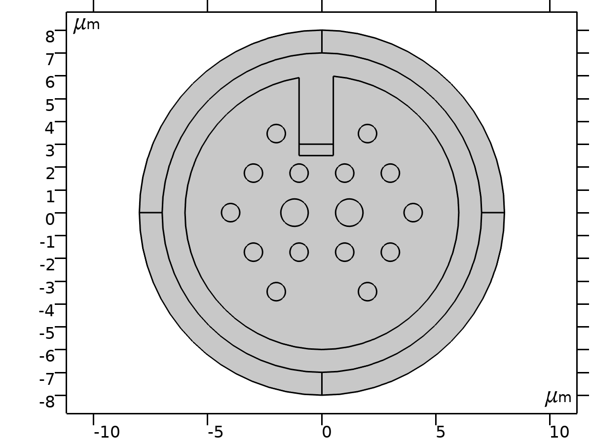
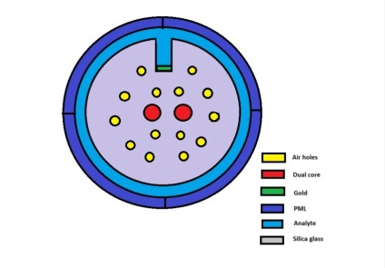
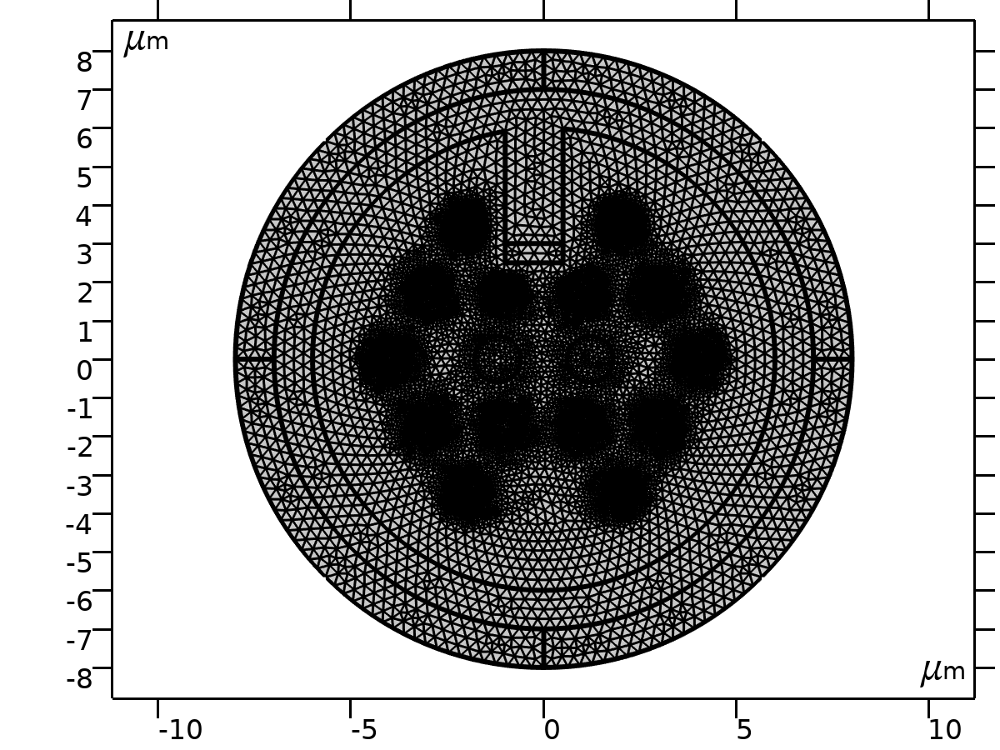
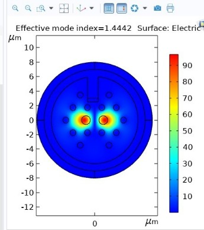
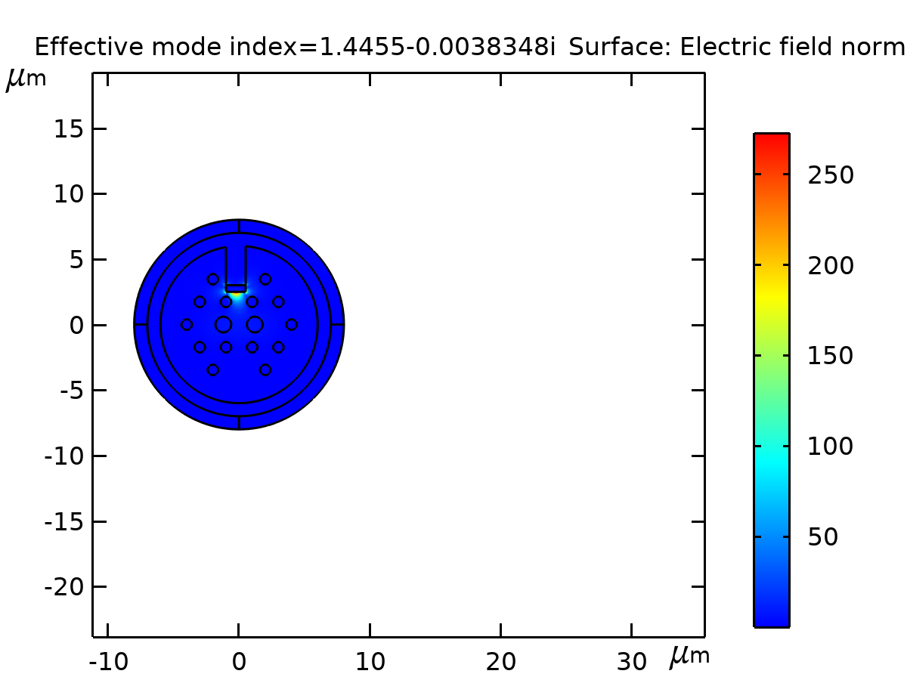
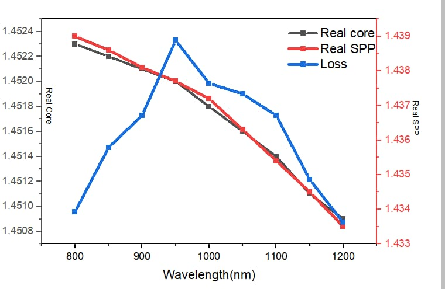
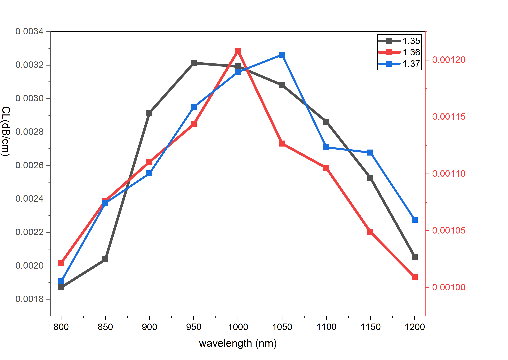
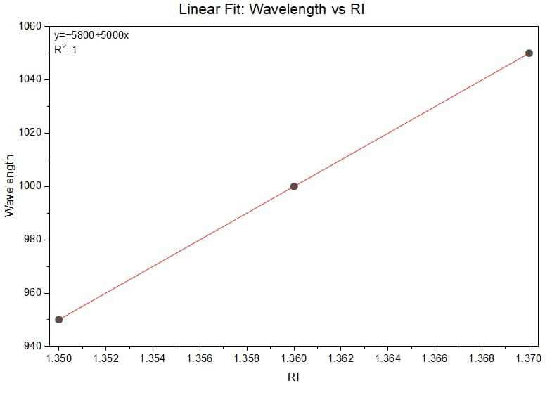
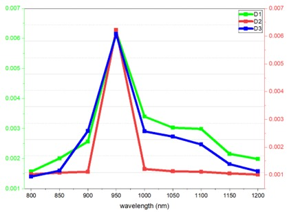
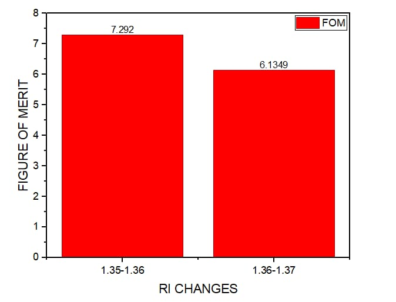

# Dual-Core PCF-SPR Sensor

## Project Overview

This project presents a COMSOL Multiphysics simulation of a **Dual-Core Photonic Crystal Fiber-Based Surface Plasmon Resonance (PCF-SPR) Sensor** for multi-parameter and pathogen detection.

The proposed sensor combines photonic crystal fiber guidance with Surface Plasmon Resonance to enable sensitive detection of changes in the surrounding refractive index.

---

## Objectives

- Design a dual-core photonic crystal fiber structure.
- Integrate a gold (Au) layer for Surface Plasmon Resonance.
- Analyze electromagnetic field distribution.
- Study the effect of refractive-index variation.
- Investigate resonance wavelength shifts.
- Evaluate sensor performance using sensitivity and Figure of Merit (FOM).
- Explore potential biomedical and pathogen detection applications.

---

## Simulation Tool

**COMSOL Multiphysics**

The model uses electromagnetic-wave simulation based on the **Finite Element Method (FEM)**.

---

## Key Parameters

| Parameter | Value / Description |
|---|---|
| Fiber structure | Dual-Core Photonic Crystal Fiber |
| Sensing mechanism | Surface Plasmon Resonance |
| Metal layer | Gold (Au) |
| Refractive index range | 1.35 – 1.37 |
| Simulation software | COMSOL Multiphysics |
| Numerical method | Finite Element Method |
| Main analysis | Electric field, dispersion and wavelength response |

---

## PCF Structure

The geometry of the proposed dual-core photonic crystal fiber is modeled in COMSOL.

---

## Mesh

A finite-element mesh is generated over the PCF structure for electromagnetic analysis.

---

## Electric Field Distribution

The electric-field distribution is analyzed to investigate the interaction between the guided optical mode and the surface plasmon mode.

---

## Dispersion Analysis

The dispersion characteristics of the proposed structure are investigated to understand the modal behavior of the sensor.

---

## Wavelength Response

The resonance wavelength response is studied for different refractive-index conditions.

---

## Sensitivity Analysis

A linear fitting analysis is performed to study the relationship between refractive index and resonance wavelength.

The diameter-dependent response is also investigated as part of the sensor optimization.

---

## Figure of Merit

The Figure of Merit (FOM) is analyzed to evaluate the sensing performance of the proposed PCF-SPR structure.

 
---

## Key Results

- Successfully modeled a dual-core photonic crystal fiber-based SPR sensor using COMSOL Multiphysics.
- Investigated electromagnetic-field distribution and interaction between the guided mode and surface plasmon mode.
- Analyzed dispersion characteristics of the proposed PCF-SPR structure.
- Studied resonance wavelength shifts for refractive-index values in the range of 1.35–1.37.
- Performed linear fitting to evaluate the relationship between refractive index and resonance wavelength.
- Investigated diameter-dependent sensor response for structural optimization.
- Evaluated sensing performance using the Figure of Merit (FOM).

## Applications

Potential applications include:

- Biomedical sensing
- Pathogen detection
- Refractive-index sensing
- Chemical and biological detection
- Medical diagnostics

---

## Future Scope

Future work can focus on:

- Optimizing the PCF geometry.
- Improving resonance coupling.
- Optimizing the gold-layer parameters.
- Increasing refractive-index sensitivity.
- Investigating additional biological analytes.
- Exploring practical experimental fabrication and validation.

---

## Project Files

The repository contains the complete COMSOL Multiphysics model:

`Dual_Core_PCF_SPR Sensor_github.mph`

The COMSOL model is stored using **Git LFS** because of its large file size.

---

## Author

**Brindha G**

B.E. Electronics and Communication Engineering